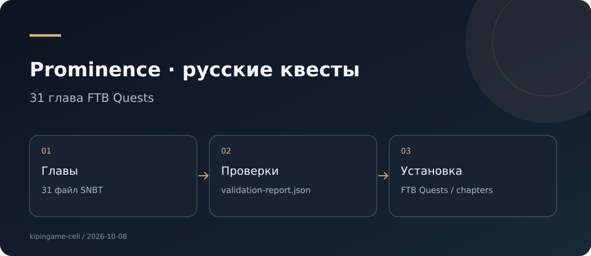
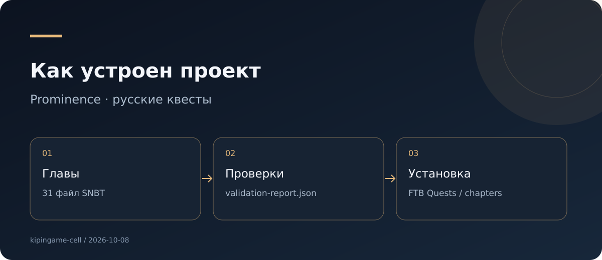

# Prominence · русские квесты

**31 глава FTB Quests**

Русский перевод предоставленных SNBT-глав FTB Quests для сборки Prominence.

**Тип:** Minecraft · перевод · **Версия:** 31 глава · ru_RU · **Документация сверена:** 2026-10-08.

[Версии и скачивание](docs/RELEASES.md) · [Аудит и предложения](docs/AUDIT.md) · [Исходники](https://github.com/kipingame-cell/prominence-quests-ru) · [Сборки](https://github.com/kipingame-cell/prominence-quests-ru/actions)

## Возможности

- 31 глава с сохранёнными идентификаторами заданий и нетекстовыми полями.
- Готовая структура chapters/ для установки в конфигурацию FTB Quests.
- Архив downloads/Prominence-quests-ru.zip.
- validation-report.json с контрольными суммами и результатами исходной проверки.

## Использование

Установку выполняют при закрытом Minecraft: сохранить копию config/ftbquests/quests/chapters и заменить её содержимое файлами chapters/. После установки проверить задания в игре.

## Устройство

Основные файлы и каталоги: `chapters/ · downloads/ · validation-report.json`.

## Проверенное состояние

Контрольные суммы всех 31 SNBT-файла повторно сверены с validation-report.json и совпали. Проверка в Minecraft здесь не выполнялась.

## Дальнейшие улучшения

- Вести глоссарий названий модов, предметов и терминов.
- Публиковать перевод как отдельный ZIP в Releases с SHA-256.
- Приложить скриншоты нескольких глав из реальной игры.

Полный список обнаруженных проблем: [AUDIT.md](docs/AUDIT.md).

Подробные материалы первоначальной редакции: [архив README](docs/README-previous.md).
